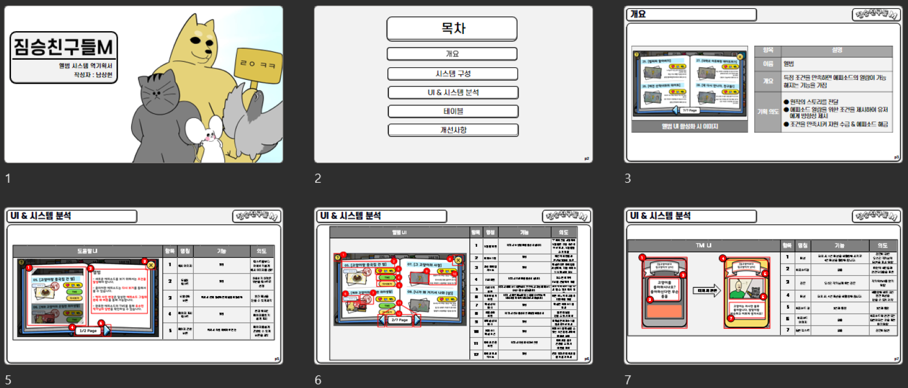

  </img>

### 
 __*Welcome to my GitHub!*__ 

  

---
 

## 📖Learning 📖  ##
>   

## 🛠️ Using Tools 🛠️ ##
></a> 
>
>
>
>

 

## 📫 Contact 📫 ## 
> oscarn0604@gmail.com

 

 

## 🌟 Portfolio 🌟

> &nbsp;  
